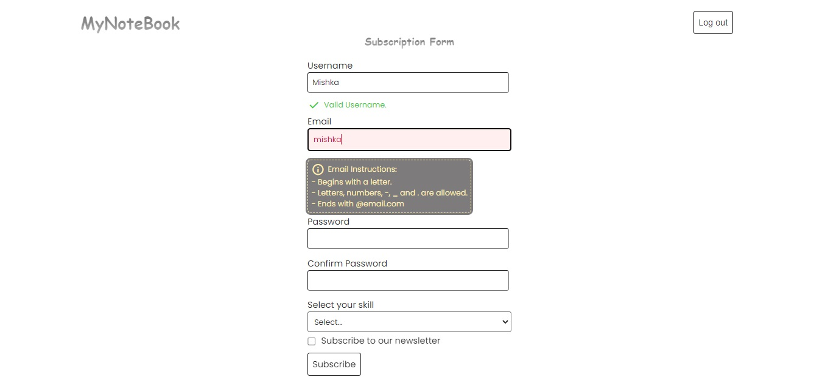
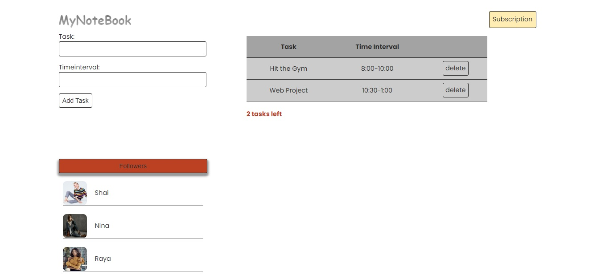

# ReactJS-MultiPageForm-Cypress-Testing (<font size='3'> V1 </font>)

#### By _**Mahashi-github**_

#### This is a ReactJS, NodeJS & MongoDB multipage form application. This application is created in order to being tested by different testing options of 'Cypress'.

* Page 1: Subscription Form. 
* Page 2: To-do add-item Form, to-do table and followers list. 

## Technologies Used
* _ReactJS_
* _React-router-dom_
* _React-Hooks (useContext, useEffect, useState)_
* _css_
* _jsx_
* _node.js_
* _express_
* _express router & MVC_
* _mongoose_
* _Cypress_

## Setup
This react app is created by 'npx create-react-app directoryName'. 

To run this project, install it locally:

First terminal:
```
$ npm install
$ npm start
```
Second terminal inside the server directory:
```
$ npm install
$ nodemon app
```
Third terminal:
```
$ npx cypress open 
```

## Screenshots of the Application
<p>
  
  
</p>